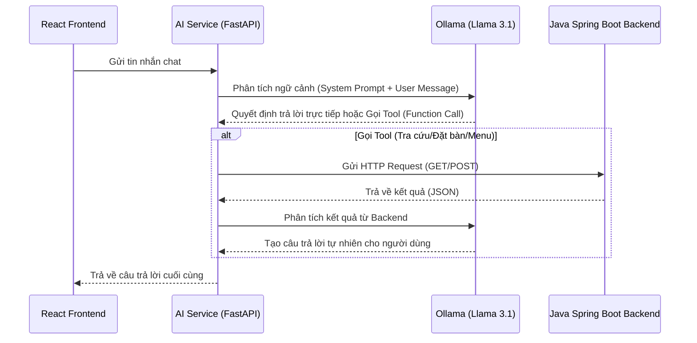

# Sơ Đồ Dữ Liệu và Luồng Hoạt Động (Data Schema & Flow) - AI Service

File này mô tả sơ đồ luồng dữ liệu (Data Flow) và cấu trúc dữ liệu (Data Schema) giữa các thành phần liên quan đến AI Service của nhà hàng Artiste.

## 1. Luồng dữ liệu tổng quan (Architecture Data Flow)

AI Service đóng vai trò là Middleware thông minh giữa **Frontend (Người dùng)** và **Java Backend (Hệ thống cốt lõi)**, sử dụng mô hình LLM (Llama 3.1 qua Ollama) để xử lý ngôn ngữ tự nhiên và gọi các công cụ (Function Calling) tương tác với API.



---

## 2. Các Cấu Trúc Dữ Liệu Giao Tiếp (Data Schema)

### 2.1. Giữa Frontend và AI Service
*File liên quan: `app/main.py`*

**Request (Frontend -> AI Service)**:
Định dạng: `JSON (application/json)`
```json
{
  "message": "Cho tôi xem thực đơn nhà hàng với, và tôi muốn đặt bàn cho 2 người vào lúc 7h tối mai."
}
```

**Response (AI Service -> Frontend)**:
Định dạng: `JSON (application/json)`
```json
{
  "answer": "Dưới đây là một số món ăn gợi ý... Tôi đã kiểm tra, 7h tối mai còn bàn. Quý khách vui lòng cung cấp thêm Tên và Số điện thoại để tôi hỗ trợ đặt bàn nhé."
}
```

### 2.2. Giữa AI Service và Java Backend (Thông qua các Tools)

AI Service sử dụng các `Tools` để thay mặt người dùng tương tác với Backend. Dưới đây là các sơ đồ dữ liệu mà AI Service gửi/nhận với Java Backend:

#### A. Tool: Tra cứu lịch trống (`check_available_slots`)
*File liên quan: `app/tools/check_slots_tool.py`*

- **Trigger:** Khi LLM nhận diện khách muốn hỏi ngày/giờ nào còn bàn trống không.
- **Request (GET `/api/public/reservations/available-times`)**:
  - `date`: `String` (Định dạng YYYY-MM-DD, vd: "2026-06-15")
  - `partySize`: `Integer` (Số lượng người)
- **Response (Từ Backend)**: 
  - Trả về danh sách (`Array<String>`) các khung giờ còn trống. Ví dụ: `["18:00:00", "19:00:00"]`

#### B. Tool: Thực hiện Đặt Bàn (`create_restaurant_booking`)
*File liên quan: `app/tools/booking_tool.py`*

- **Trigger:** Khi LLM đã thu thập đủ 4 thông tin: Tên, SĐT, Số người, và Ngày giờ.
- **Request (POST `/api/public/reservations`)**:
  - Định dạng Body (JSON):
  ```json
  {
    "customerName": "Nguyễn Văn A",
    "customerPhone": "0901234567",
    "partySize": 2,
    "reservedAt": "2026-06-16T19:00:00+07:00",
    "note": ""
  }
  ```
- **Response (Từ Backend)**: Status code `200` hoặc `201` nếu thành công. AI Service tự động dịch ra câu thông báo thành công cho khách.

#### C. Tool: Gợi ý Menu Cơ Bản (`get_restaurant_menu_for_suggestion`)
*File liên quan: `app/tools/menu_suggestion_tool.py`*

- **Trigger:** Khi khách hàng yêu cầu xem menu chung.
- **Request (GET `/api/public/menu`)**: Không yêu cầu Params.
- **Response Schema (Từ Backend nhận về AI)**:
  ```json
  {
    "data": [
      {
        "items": [
          {
            "name": "Bò bít tết",
            "price": 250000,
            "category": "Món chính"
          }
        ]
      }
    ]
  }
  ```
- *Xử lý trong AI:* AI Service sẽ ngẫu nhiên lấy ra 5 món ăn từ danh sách để hiển thị cho khách tránh làm tràn khung chat.

#### D. Tool: Gợi ý Set Món Theo Ngân Sách (`suggest_set_menu`)
*File liên quan: `app/tools/menu_suggestion_tool.py`*

- **Trigger:** Khi khách hàng yêu cầu gợi ý set món dựa trên số tiền (VD: "Có set nào 500k không em?").
- **LLM Parse Argument:**
  - `budget`: `Integer` (Ví dụ 500k -> `500000`).
- **Request (GET `/api/public/menu`)**: Lấy toàn bộ thực đơn giống Tool C.
- **Xử lý nội bộ tại AI Service**: 
  - AI Service (Python) thực hiện trích xuất ngẫu nhiên các món ăn và cộng dồn giá (`price`).
  - Dừng lại khi `Tổng tiền <= budget`.
  - Nếu không đủ tiền mua món rẻ nhất, trả về thông báo lỗi ngân sách.

---

## 3. Cấu trúc System Prompt & Ngày giờ động

Để mô hình Llama 3 hiểu được khái niệm "ngày mai", "tuần sau" mà không cần Database riêng, AI Service tiêm (`inject`) một **bản đồ thời gian** ở mỗi lượt request trong `SystemMessage` tại `app/services/agent_service.py`.

```text
- Hôm nay: YYYY-MM-DD
- Ngày mai: YYYY-MM-DD
- Ngày mốt: YYYY-MM-DD
- Tuần này: [Thứ 2: ..., Thứ 3: ...]
- Tuần sau: [Thứ 2: ..., Thứ 3: ...]
```

Dữ liệu này được Generate realtime bằng Python `datetime` và không hiển thị cho người dùng.
