# Giao diện Frontend-User (Các Trang & Vai Trò)

Tài liệu này mô tả chi tiết các trang trong ứng dụng `frontend-user` dưới các góc nhìn (roles) khác nhau: **Khách (Guest)**, **Khách hàng (Customer)**, và **Nhân viên (Staff)**. Các ảnh chụp màn hình được lưu trong thư mục `screenshots/`.

## Danh sách các màn hình

| STT | Màn hình | Loại màn hình | Chức năng |
| --- | --- | --- | --- |
| 1 | Trang Chủ (Home) | Màn hình chính | Giới thiệu sơ lược về nhà hàng (slogan, món ăn nổi bật) |
| 2 | Trang Thực Đơn (Menu) | Màn hình chính | Giới thiệu danh sách các món ăn của nhà hàng |
| 3 | Trang Liên Hệ (Contact) | Màn hình chính | Hiển thị thông tin liên hệ và bản đồ vị trí |
| 4 | Trang Đăng Nhập (Login) | Màn hình nhập liệu | Yêu cầu người dùng nhập thông tin đăng nhập |
| 5 | Trang Đăng Ký (Register) | Màn hình nhập liệu | Yêu cầu người dùng nhập thông tin đăng ký |
| 6 | Quên Mật Khẩu (Forgot Password) | Màn hình nhập liệu | Yêu cầu nhập email để khôi phục mật khẩu |
| 7 | Trang Đặt Bàn (Booking) | Màn hình nhập liệu | Yêu cầu nhập thông tin ngày giờ, số lượng khách để đặt bàn |
| 8 | Tra cứu bàn trống | Màn hình tra cứu | Cho phép nhập các tiêu chuẩn tra cứu bàn trống |
| 9 | Hồ Sơ Cá Nhân (Customer) | Màn hình nhập liệu | Cho phép chỉnh sửa thông tin cá nhân khách hàng và xem lịch sử |
| 10 | Đổi Mật Khẩu | Màn hình nhập liệu | Yêu cầu nhập mật khẩu cũ và mới để thay đổi |
| 11 | Trang Quản Lý Nhân Viên | Màn hình tra cứu | Hiện danh sách bàn, các đơn hàng và nút thao tác duyệt đơn |
| 12 | Hồ Sơ Cá Nhân (Staff) | Màn hình chính | Hiện thông tin cá nhân và huy hiệu của nhân viên |

---

## 1. Dành cho Khách chưa đăng nhập (Guest)

Người dùng chưa đăng nhập có thể xem thông tin giới thiệu, thực đơn, liên hệ và truy cập chức năng đăng nhập, đăng ký.

### Trang Chủ (Home)
Giao diện chính giới thiệu nhà hàng, nổi bật với thiết kế trực quan.
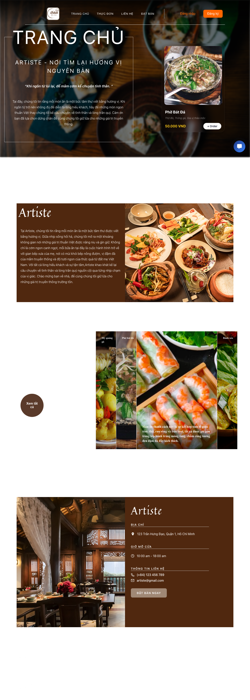

**Các đối tượng chính trên màn hình:**
| STT | Tên | Kiểu | Ràng buộc | Chức năng |
| --- | --- | --- | --- | --- |
| 1 | Thanh Header | Header | Luôn hiển thị | Hiển thị logo, menu điều hướng và nút Đăng nhập |
| 2 | Hero Section | Section | Luôn hiển thị | Hiển thị banner lớn, slogan và nút "Đặt bàn ngay" |
| 3 | About Section | Section | Luôn hiển thị | Giới thiệu ngắn gọn về lịch sử và không gian nhà hàng |
| 4 | Menu Preview | Section | Luôn hiển thị | Trưng bày các món ăn nổi bật (Best sellers) |
| 5 | Thanh Footer | Footer | Luôn hiển thị | Hiển thị thông tin bản quyền, mạng xã hội và liên kết nhanh |

**Danh sách biến cố và xử lý tương ứng trên màn hình:**
| STT | Biến cố | Xử lý |
| --- | --- | --- |
| 1 | Mở màn hình | Load thông tin banner và các món ăn nổi bật (Best sellers) từ CSDL rồi hiển thị lên giao diện |
| 2 | Nhấn nút "Đặt bàn ngay" | Kiểm tra trạng thái đăng nhập -> Nếu chưa, chuyển hướng sang trang Đăng nhập. Nếu đã đăng nhập, chuyển sang trang Đặt bàn |
| 3 | Nhấn chọn một mục trên thanh Header (Thực đơn, Liên hệ) | Chuyển hướng mượt mà sang trang tương ứng |
| 4 | Nhấn nút "Đăng nhập" trên Header | Chuyển hướng người dùng sang trang Đăng nhập |
| 5 | Nhấn vào một thẻ món ăn nổi bật | Hiển thị popup chi tiết món ăn (hoặc chuyển sang trang chi tiết món ăn) |
| 6 | Cuộn trang xuống (Scroll) | Kích hoạt các hiệu ứng xuất hiện (fade-in, slide-up) cho các phần tử như Hero, About, Menu Preview |

### Trang Thực Đơn (Menu)
Xem danh sách các món ăn của nhà hàng.
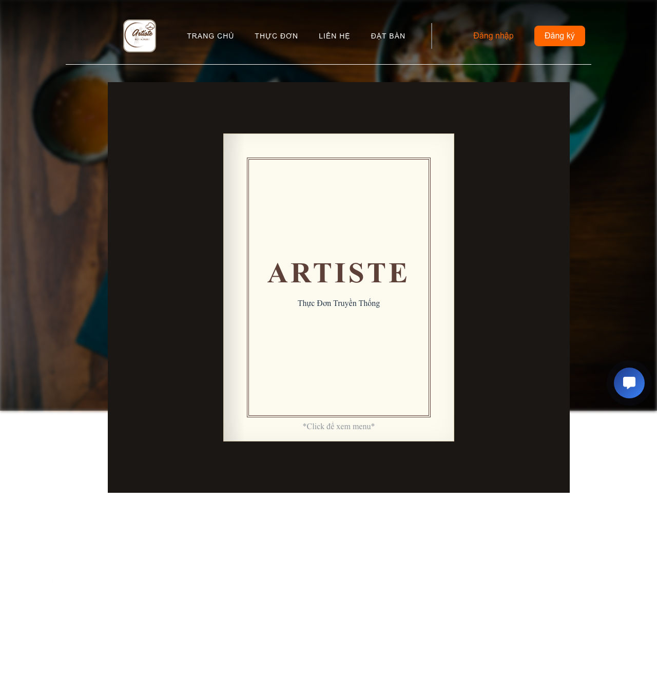

**Các đối tượng chính trên màn hình:**
| STT | Tên | Kiểu | Ràng buộc | Chức năng |
| --- | --- | --- | --- | --- |
| 1 | Thanh Header | Header | Luôn hiển thị | Điều hướng trang |
| 2 | Danh mục món ăn | Tabs / List | Luôn hiển thị | Phân loại món ăn (Khai vị, Món chính, Tráng miệng, Đồ uống) |
| 3 | Danh sách món ăn | Grid / Danh sách | Theo danh mục | Hiển thị hình ảnh, tên món, mô tả và giá tiền |
| 4 | Thanh Footer | Footer | Luôn hiển thị | Hiển thị thông tin chung |

**Danh sách biến cố và xử lý tương ứng trên màn hình:**
| STT | Biến cố | Xử lý |
| --- | --- | --- |
| 1 | Mở màn hình | Load danh sách toàn bộ các danh mục và món ăn từ CSDL |
| 2 | Nhấn chọn một danh mục trên Tabs | Lọc và chỉ hiển thị danh sách món ăn tương ứng với danh mục được chọn (Khai vị, Món chính...) |
| 3 | Nhấn vào thanh tìm kiếm và nhập từ khóa (nếu có) | Lọc danh sách món ăn hiển thị theo từ khóa khớp với tên hoặc mô tả món ăn |
| 4 | Lỗi kết nối khi load màn hình | Hiển thị thông báo "Không thể tải dữ liệu thực đơn lúc này, vui lòng thử lại sau" |

### Trang Liên Hệ (Contact)
Hiển thị thông tin liên hệ và vị trí của nhà hàng.
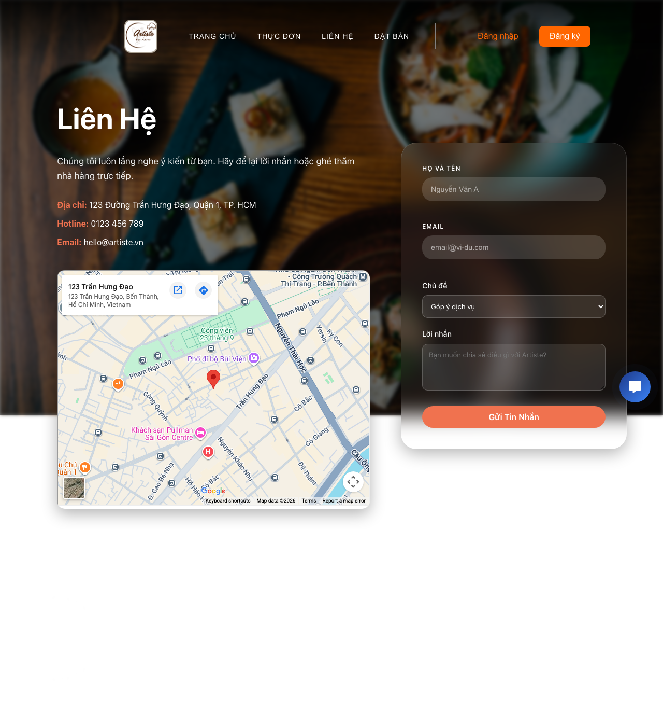

**Các đối tượng chính trên màn hình:**
| STT | Tên | Kiểu | Ràng buộc | Chức năng |
| --- | --- | --- | --- | --- |
| 1 | Thanh Header | Header | Luôn hiển thị | Điều hướng trang |
| 2 | Thông tin liên hệ | Section | Luôn hiển thị | Hiển thị địa chỉ, số điện thoại, email, giờ mở cửa |
| 3 | Bản đồ (Map) | iframe/Bản đồ | Luôn hiển thị | Hiển thị vị trí nhà hàng trên Google Maps |
| 4 | Form liên hệ | Form | Luôn hiển thị | Cho phép khách gửi lời nhắn (Tên, Email, Nội dung, Nút Gửi) |

**Danh sách biến cố và xử lý tương ứng trên màn hình:**
| STT | Biến cố | Xử lý |
| --- | --- | --- |
| 1 | Nhấn nút "Gửi" trong form liên hệ | Kiểm tra hợp lệ dữ liệu -> Nếu hợp lệ, gọi API lưu lời nhắn vào CSDL -> Hiển thị popup/toast báo thành công và xóa trắng form |
| 2 | Nhập sai định dạng email | Highlight ô nhập liệu và hiển thị lỗi màu đỏ: "Email không đúng định dạng hợp lệ" |
| 3 | Bỏ trống thông tin bắt buộc (Tên, Email, Nội dung) | Ngăn form submit, highlight các ô bị trống và báo lỗi: "Vui lòng nhập đầy đủ thông tin" |
| 4 | Nhấn vào icon mạng xã hội ở Footer | Mở tab mới chuyển hướng đến các trang Facebook, Instagram... của nhà hàng |
| 5 | Không thể load Google Maps | Hiển thị thông báo "Bản đồ hiện không khả dụng" tại khu vực iframe bản đồ |

### Trang Đăng Nhập (Login)
Cho phép khách hàng và nhân viên đăng nhập.
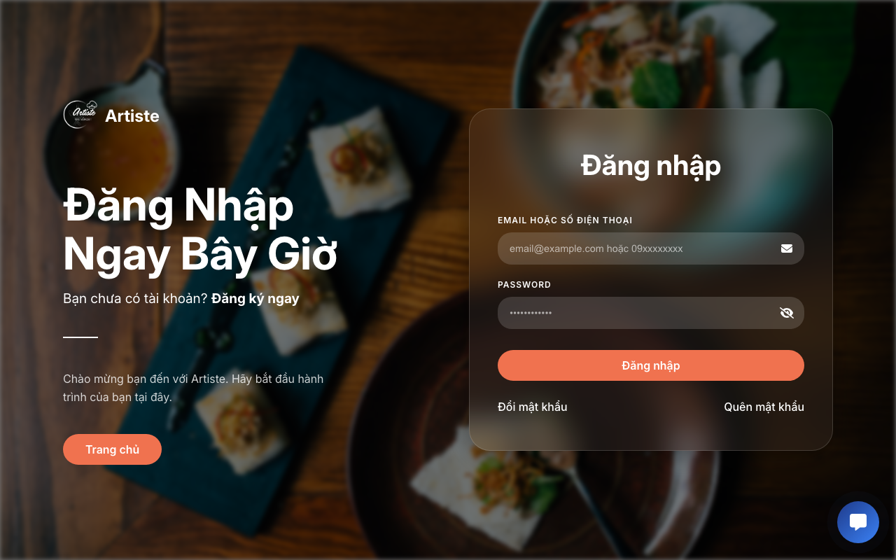

**Các đối tượng chính trên màn hình:**
| STT | Tên | Kiểu | Ràng buộc | Chức năng |
| --- | --- | --- | --- | --- |
| 1 | Thanh Header | Header | Luôn hiển thị | Điều hướng trang |
| 2 | Form đăng nhập | Form | Luôn hiển thị | Form chứa các trường nhập liệu để đăng nhập |
| 3 | Email / Số điện thoại | Ô nhập liệu | Bắt buộc | Nhập tài khoản người dùng hoặc nhân viên |
| 4 | Mật khẩu | Ô nhập liệu | Bắt buộc | Nhập mật khẩu (có nút ẩn/hiện) |
| 5 | Quên mật khẩu | Link | Tùy chọn | Chuyển hướng sang trang lấy lại mật khẩu |
| 6 | Nút "Đăng nhập" | Button | Luôn hiển thị | Gửi thông tin đăng nhập lên hệ thống |
| 7 | Chuyển sang Đăng ký | Link | Tùy chọn | Chuyển hướng sang trang đăng ký tài khoản |

**Danh sách biến cố và xử lý tương ứng trên màn hình:**
| STT | Biến cố | Xử lý |
| --- | --- | --- |
| 1 | Nhấn "Đăng nhập" với thông tin hợp lệ | Gửi request xác thực lên server -> Lấy token lưu vào local/session storage -> Chuyển hướng theo role (Khách hàng về Home, Nhân viên về Dashboard) |
| 2 | Nhập sai định dạng email / số điện thoại | Ngăn submit form và hiển thị cảnh báo ngay bên dưới ô nhập: "Định dạng email hoặc số điện thoại không hợp lệ" |
| 3 | Bỏ trống thông tin tài khoản hoặc mật khẩu | Ngăn submit form và báo lỗi: "Vui lòng điền đầy đủ thông tin đăng nhập" |
| 4 | Tài khoản hoặc mật khẩu không đúng (lỗi server) | Hiển thị thông báo lỗi từ server: "Tài khoản hoặc mật khẩu không chính xác" |
| 5 | Nhấn biểu tượng con mắt (Show/Hide password) | Chuyển đổi trạng thái hiển thị của ô mật khẩu giữa dạng văn bản rõ và dạng dấu sao (*) |
| 6 | Nhấn "Quên mật khẩu?" | Chuyển hướng sang trang Quên mật khẩu |
| 7 | Nhấn "Đăng ký ngay" | Chuyển hướng sang trang Đăng ký tài khoản |

### Trang Đăng Ký (Register)
Đăng ký tài khoản khách hàng mới.
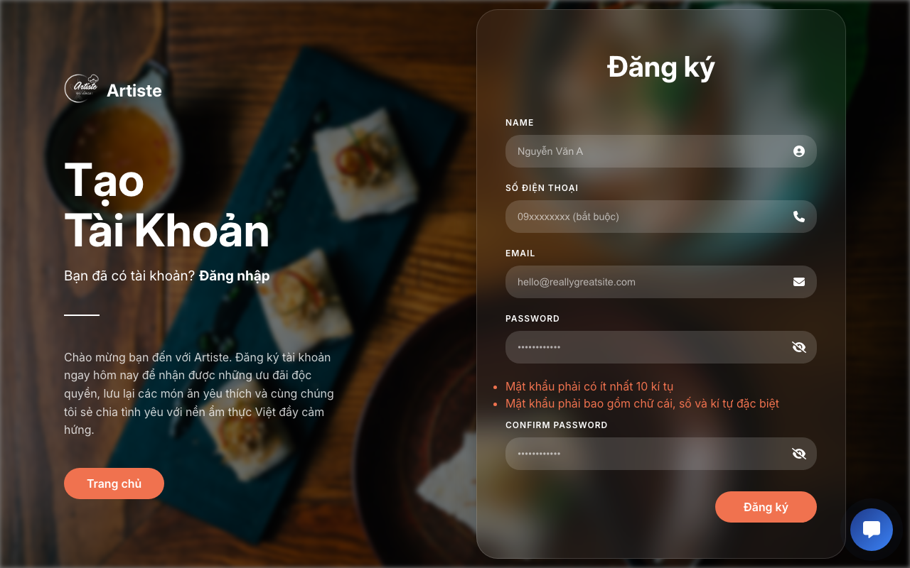

**Các đối tượng chính trên màn hình:**
| STT | Tên | Kiểu | Ràng buộc | Chức năng |
| --- | --- | --- | --- | --- |
| 1 | Form đăng ký | Form | Luôn hiển thị | Form chứa các trường điền thông tin |
| 2 | Họ và tên | Ô nhập liệu | Bắt buộc | Nhập tên đầy đủ |
| 3 | Email | Ô nhập liệu | Bắt buộc | Nhập địa chỉ email |
| 4 | Số điện thoại | Ô nhập liệu | Bắt buộc | Nhập số điện thoại |
| 5 | Mật khẩu & Nhập lại | Ô nhập liệu | Bắt buộc | Thiết lập mật khẩu và xác nhận |
| 6 | Nút "Đăng ký" | Button | Luôn hiển thị | Tạo tài khoản mới |

**Danh sách biến cố và xử lý tương ứng trên màn hình:**
| STT | Biến cố | Xử lý |
| --- | --- | --- |
| 1 | Nhấn "Đăng ký" với thông tin hợp lệ | Gọi API đăng ký -> Tạo tài khoản thành công -> Hiển thị popup "Đăng ký thành công" và tự động chuyển về trang Đăng nhập |
| 2 | Nhập email hoặc số điện thoại đã tồn tại trên hệ thống | Ngăn gửi lại form, hiển thị thông báo lỗi từ server: "Email hoặc số điện thoại này đã được đăng ký" |
| 3 | Nhập mật khẩu xác nhận không khớp | Báo lỗi ngay lập tức dưới ô xác nhận: "Mật khẩu xác nhận không trùng khớp" |
| 4 | Nhập sai định dạng số điện thoại | Báo lỗi: "Số điện thoại phải gồm 10 chữ số và bắt đầu bằng số 0" |
| 5 | Nhập mật khẩu quá ngắn (< 6 ký tự) | Hiển thị cảnh báo: "Mật khẩu phải có tối thiểu 6 ký tự" |
| 6 | Bỏ trống các trường bắt buộc | Highlight ô nhập liệu và hiển thị thông báo "Trường này là bắt buộc" |

### Quên Mật Khẩu (Forgot Password)
Phục hồi mật khẩu khi người dùng quên.
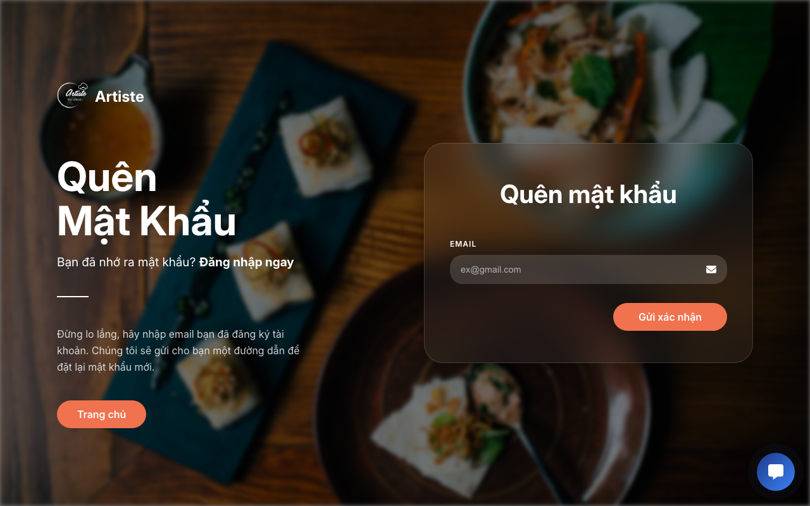

**Các đối tượng chính trên màn hình:**
| STT | Tên | Kiểu | Ràng buộc | Chức năng |
| --- | --- | --- | --- | --- |
| 1 | Form phục hồi | Form | Luôn hiển thị | Giao diện lấy lại mật khẩu |
| 2 | Email | Ô nhập liệu | Bắt buộc | Nhập email đã đăng ký để nhận mã |
| 3 | Nút "Gửi yêu cầu" | Button | Luôn hiển thị | Gửi email chứa hướng dẫn khôi phục |

**Danh sách biến cố và xử lý tương ứng trên màn hình:**
| STT | Biến cố | Xử lý |
| --- | --- | --- |
| 1 | Nhấn "Gửi yêu cầu" với email hợp lệ | Gọi API kiểm tra -> Gửi OTP/link khôi phục qua email -> Hiển thị thông báo "Vui lòng kiểm tra hộp thư email của bạn" |
| 2 | Email không tồn tại trong hệ thống | Hiển thị thông báo lỗi: "Email này không tồn tại hoặc chưa được đăng ký" |
| 3 | Nhập sai định dạng email | Hiển thị cảnh báo: "Email không hợp lệ" |
| 4 | Bỏ trống trường Email | Ngăn submit và yêu cầu "Vui lòng nhập email" |
| 5 | Nhấn "Quay lại đăng nhập" | Hủy thao tác và chuyển hướng về trang Đăng nhập |

---

## 2. Dành cho Khách hàng (Customer)

Sau khi đăng nhập với tư cách khách hàng (`CUSTOMER`), người dùng có thể đặt bàn, xem thông tin tài khoản và đổi mật khẩu.

### Trang Đặt Bàn (Booking)
Cho phép khách hàng thực hiện các nghiệp vụ đặt bàn trước.
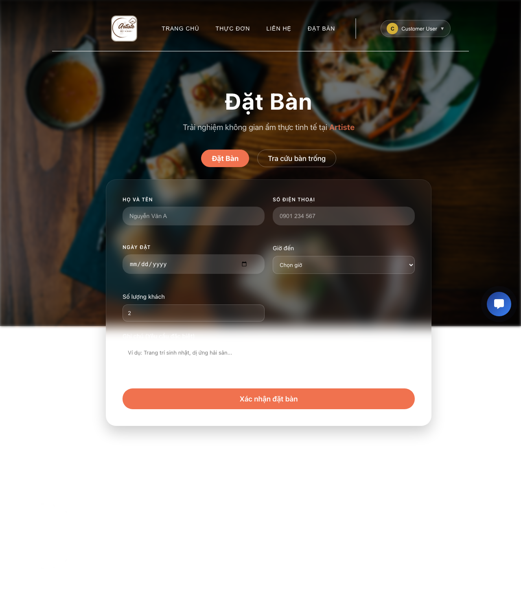

**Các đối tượng chính trên màn hình:**
| STT | Tên | Kiểu | Ràng buộc | Chức năng |
| --- | --- | --- | --- | --- |
| 1 | Thanh Header | Header | Luôn hiển thị | Hiển thị avatar/tên khách hàng |
| 2 | Tabs giao diện | Tabs | Luôn hiển thị | Chuyển đổi giữa "Đặt Bàn" và "Tra cứu bàn trống" |
| 3 | Form Đặt Bàn | Form | Khi chọn Tab Đặt bàn | Điền thông tin đặt bàn |
| 4 | Ngày & Giờ | Ô chọn (Date/Time)| Bắt buộc | Chọn ngày và khung giờ (chỉ chọn giờ trong khoảng mở cửa) |
| 5 | Số lượng khách | Ô nhập số | Bắt buộc, > 0 | Chỉ định số lượng người tham gia |
| 6 | Ghi chú | Ô nhập văn bản | Tùy chọn | Yêu cầu đặc biệt (dị ứng, trang trí, v.v) |
| 7 | Form Tra cứu | Form | Khi chọn Tab Tra cứu | Xem các ngày hoặc giờ còn bàn trống |
| 8 | Nút Xác nhận | Button | Luôn hiển thị | Gửi yêu cầu đặt bàn hoặc tra cứu |

**Danh sách biến cố và xử lý tương ứng trên màn hình:**
| STT | Biến cố | Xử lý |
| --- | --- | --- |
| 1 | Mở tab "Đặt Bàn" | Tự động điền các thông tin mặc định nếu người dùng đã đăng nhập (Tên, SĐT, Email) |
| 2 | Nhấn "Xác nhận" (Đặt bàn hợp lệ) | Kiểm tra dữ liệu -> Gọi API đặt bàn -> Nhận phản hồi thành công -> Hiển thị popup "Đặt bàn thành công" kèm mã đặt bàn |
| 3 | Chọn ngày/giờ trong quá khứ hoặc ngoài giờ làm việc | Chặn thao tác và hiển thị cảnh báo: "Vui lòng chọn thời gian hợp lệ trong tương lai và trong khung giờ hoạt động" |
| 4 | Nhập số lượng khách <= 0 | Báo lỗi "Số lượng khách phải lớn hơn 0" |
| 5 | Hết bàn trống trong khung giờ đã chọn | Hiển thị thông báo lỗi từ server: "Xin lỗi, nhà hàng đã hết bàn trống trong khung giờ này" |
| 6 | Chuyển sang tab "Tra cứu bàn trống" | Ẩn form đặt bàn và hiển thị giao diện của form tra cứu bàn |
| 7 | Nhấn "Xác nhận" (Tab Tra cứu) | Gửi request tìm kiếm theo tiêu chí -> Trả về và hiển thị danh sách các bàn/khung giờ còn trống |

### Hồ Sơ Cá Nhân (Profile)
Quản lý thông tin cá nhân và xem lịch sử các hoạt động.
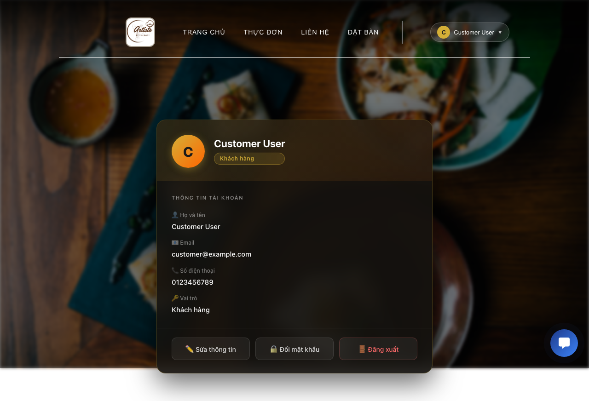

**Các đối tượng chính trên màn hình:**
| STT | Tên | Kiểu | Ràng buộc | Chức năng |
| --- | --- | --- | --- | --- |
| 1 | Thanh Header | Header | Luôn hiển thị | Điều hướng |
| 2 | Thông tin cá nhân | Section | Luôn hiển thị | Hiển thị Tên, Email, SĐT, Ngày tham gia, Vai trò |
| 3 | Nút "Cập nhật" | Button | Tùy chọn | Cho phép chỉnh sửa thông tin cá nhân |
| 4 | Lịch sử Đặt bàn | Danh sách | Nếu có dữ liệu | Hiển thị danh sách các lần đặt bàn trước đây và trạng thái |
| 5 | Nút Đăng xuất | Button | Luôn hiển thị | Đăng xuất khỏi tài khoản |

**Danh sách biến cố và xử lý tương ứng trên màn hình:**
| STT | Biến cố | Xử lý |
| --- | --- | --- |
| 1 | Mở màn hình Hồ sơ | Load dữ liệu cá nhân hiện tại (Tên, Email, SĐT) và danh sách lịch sử đặt bàn từ API |
| 2 | Nhấn "Cập nhật" (Thay đổi thông tin hợp lệ) | Kiểm tra validate form -> Gọi API PUT cập nhật CSDL -> Hiển thị toast "Cập nhật hồ sơ thành công" |
| 3 | Nhập sai định dạng số điện thoại khi cập nhật | Báo lỗi: "Số điện thoại không hợp lệ (10 số, bắt đầu bằng 0)" |
| 4 | Bỏ trống thông tin bắt buộc khi cập nhật | Báo lỗi màu đỏ dưới input: "Vui lòng không bỏ trống trường này" |
| 5 | Nhấn "Xem chi tiết" trên một đơn đặt bàn | Mở popup hiển thị thông tin chi tiết (mã đơn, số người, ghi chú, trạng thái) |
| 6 | Nhấn "Đăng xuất" | Xóa toàn bộ dữ liệu phiên làm việc (token) và chuyển hướng về trang Chủ / Đăng nhập |

### Đổi Mật Khẩu (Change Password)
Bảo mật tài khoản bằng cách thay đổi mật khẩu định kỳ.
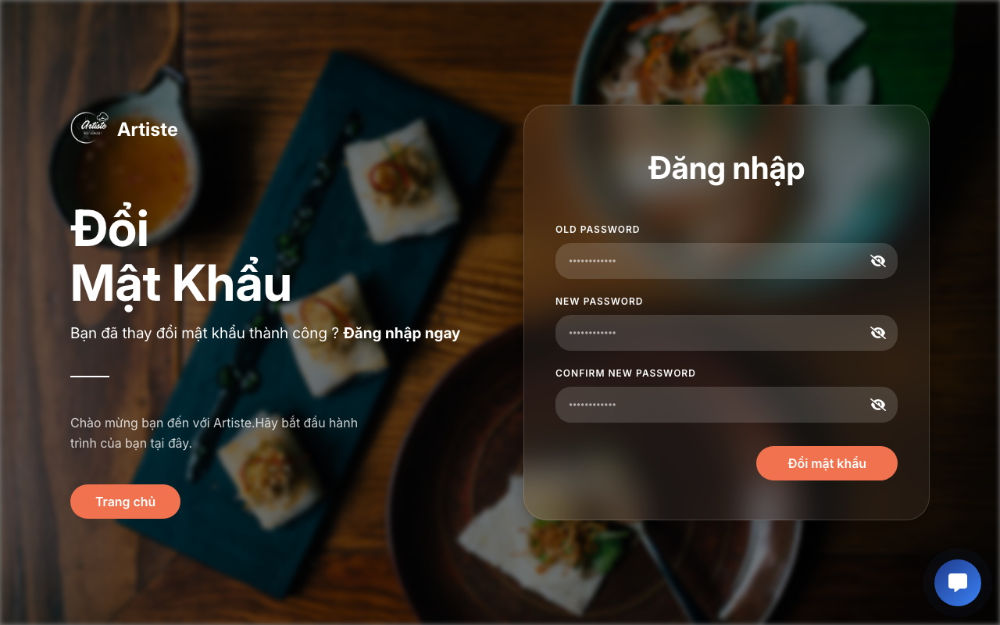

**Các đối tượng chính trên màn hình:**
| STT | Tên | Kiểu | Ràng buộc | Chức năng |
| --- | --- | --- | --- | --- |
| 1 | Mật khẩu hiện tại | Ô nhập liệu | Bắt buộc | Xác thực người dùng hiện tại |
| 2 | Mật khẩu mới | Ô nhập liệu | Bắt buộc, >6 ký tự | Thiết lập mật khẩu mới |
| 3 | Xác nhận mật khẩu | Ô nhập liệu | Bắt buộc | Đảm bảo nhập đúng mật khẩu mới |
| 4 | Nút "Đổi mật khẩu" | Button | Luôn hiển thị | Thực hiện đổi mật khẩu |

**Danh sách biến cố và xử lý tương ứng trên màn hình:**
| STT | Biến cố | Xử lý |
| --- | --- | --- |
| 1 | Nhấn "Đổi mật khẩu" (Thành công) | Gửi mật khẩu cũ và mới lên server -> Kiểm tra thành công -> Lưu CSDL -> Hiển thị toast "Đổi mật khẩu thành công" và reset form |
| 2 | Nhập sai mật khẩu hiện tại | Server trả về lỗi -> Hiển thị dòng chữ: "Mật khẩu hiện tại không chính xác" |
| 3 | Mật khẩu mới quá ngắn (< 6 ký tự) | Cảnh báo ngay dưới ô nhập liệu: "Mật khẩu mới phải có tối thiểu 6 ký tự" |
| 4 | Nhập mật khẩu xác nhận không khớp | Cảnh báo: "Mật khẩu xác nhận không trùng khớp với mật khẩu mới" |
| 5 | Bỏ trống bất kỳ trường nào | Ngăn submit, yêu cầu "Vui lòng điền đầy đủ các trường" |
| 6 | Nhấn icon con mắt ở các trường mật khẩu | Bật/Tắt chế độ hiển thị rõ ký tự thay vì dấu sao (*) |

*(Các trang Home, Menu, Contact tương tự như Guest nhưng Header sẽ hiển thị trạng thái đã đăng nhập của Khách hàng).*

---

## 3. Dành cho Nhân viên (Staff)

Nhân viên (`STAFF`) khi đăng nhập sẽ thấy huy hiệu nhân viên và có quyền truy cập vào các trang nghiệp vụ để quản lý hoạt động nhà hàng.

### Trang Quản Lý Nhân Viên (Staff Dashboard)
Bảng điều khiển (dashboard) dành riêng cho nghiệp vụ của nhân viên.
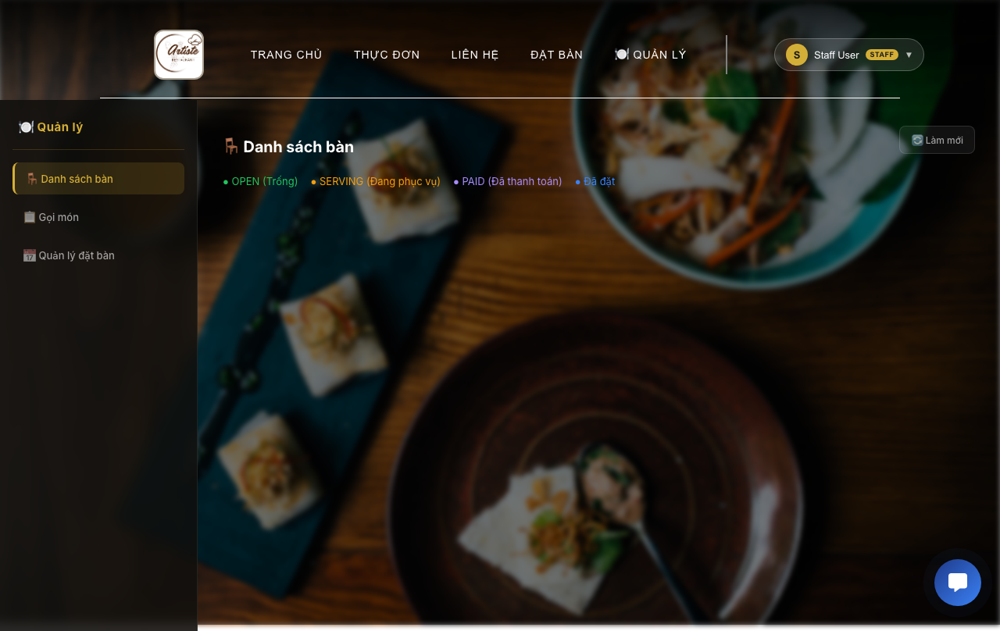

**Các đối tượng chính trên màn hình:**
| STT | Tên | Kiểu | Ràng buộc | Chức năng |
| --- | --- | --- | --- | --- |
| 1 | Thanh Header | Header | Luôn hiển thị | Có thêm huy hiệu 🔑 Nhân viên |
| 2 | Dashboard Menu | Sidebar / Tabs | Luôn hiển thị | Chuyển đổi giữa các nghiệp vụ: Quản lý bàn, Đơn hàng, Món ăn |
| 3 | Khu vực dữ liệu | Bảng / Grid | Theo Tab chọn | Hiển thị danh sách bàn, trạng thái đơn hàng (Chờ duyệt, Đang nấu, Đã giao) |
| 4 | Nút Hành động | Button | Đi kèm mỗi item | Duyệt đơn, Hoàn thành món, Thanh toán, Hủy đơn |
| 5 | Khu vực Thống kê | Widget | Tùy chọn | Hiển thị tổng quan số lượng bàn trống, đơn trong ngày |

**Danh sách biến cố và xử lý tương ứng trên màn hình:**
| STT | Biến cố | Xử lý |
| --- | --- | --- |
| 1 | Mở màn hình Dashboard | Khởi tạo kết nối, gọi API lấy danh sách tổng quát (Bàn, Đơn chờ duyệt, Đơn đang nấu, Số liệu thống kê trong ngày) và hiển thị |
| 2 | Hệ thống có đơn đặt bàn mới (Realtime/Polling) | Tự động cập nhật danh sách đơn hàng và hiển thị icon thông báo/chấm đỏ |
| 3 | Nhấn "Duyệt đơn" (Đơn mới) | Gửi request cập nhật trạng thái đơn thành "Đã duyệt/Đang nấu" -> Chuyển đơn sang cột tương ứng trên UI |
| 4 | Nhấn "Hoàn thành món" / "Giao món" | Cập nhật trạng thái đơn hàng để phục vụ -> Cập nhật UI |
| 5 | Nhấn "Thanh toán" | Bật popup hiển thị chi tiết hóa đơn (món ăn, tổng tiền, thuế) -> Xác nhận thanh toán -> Cập nhật trạng thái bàn thành "Trống" |
| 6 | Nhấn "Hủy đơn" | Bật dialog yêu cầu nhân viên điền lý do hủy và xác nhận -> Gọi API đổi trạng thái "Đã hủy" |
| 7 | Nhấn chuyển Tab ở Sidebar | Ẩn/Hiện tương ứng các khu vực hiển thị dữ liệu (Quản lý Bàn, Quản lý Món ăn, Quản lý Đơn hàng) |

### Hồ Sơ Cá Nhân (Profile)
Hiển thị thông tin hồ sơ với huy hiệu `Nhân viên`.
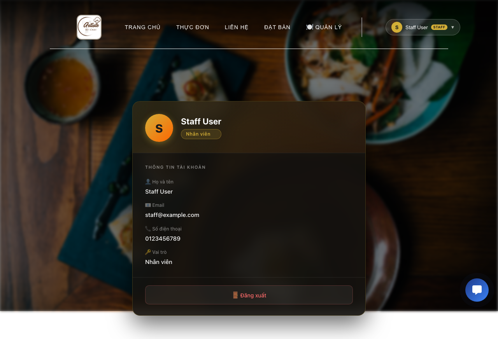

**Các đối tượng chính trên màn hình:**
| STT | Tên | Kiểu | Ràng buộc | Chức năng |
| --- | --- | --- | --- | --- |
| 1 | Avatar & Badge | Hình ảnh/Text | Luôn hiển thị | Hiển thị chức danh Nhân viên / Admin rõ ràng |
| 2 | Thông tin làm việc | Section | Luôn hiển thị | Thông tin nhân viên (Mã NV, Tên, Ca làm việc) |
| 3 | Nút Đăng xuất | Button | Luôn hiển thị | Đăng xuất khỏi hệ thống quản trị |

**Danh sách biến cố và xử lý tương ứng trên màn hình:**
| STT | Biến cố | Xử lý |
| --- | --- | --- |
| 1 | Mở màn hình Hồ sơ Nhân viên | Load thông tin nhân viên, chức danh, quyền hạn và ca làm việc hiện tại từ API |
| 2 | Nhấn "Cập nhật" (nếu có quyền) | Xác thực dữ liệu form -> Lưu thông tin phụ (Số điện thoại, Địa chỉ) vào CSDL -> Thông báo thành công |
| 3 | Nhấn "Xem lịch làm việc" | Chuyển hướng sang giao diện hiển thị bảng chấm công / ca trực trong tháng |
| 4 | Nhấn "Đăng xuất" | Yêu cầu xác nhận -> Gọi API hủy token -> Xóa local storage và chuyển hướng nhân viên về trang Đăng nhập quản trị |

*(Các trang Home, Menu, Contact tương tự như Customer nhưng Header sẽ hiển thị huy hiệu Nhân viên).*
